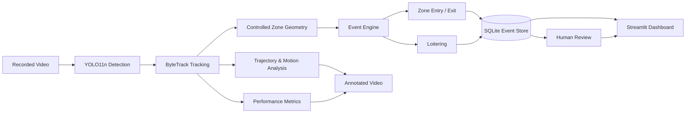

# GPU-Accelerated Video Analytics & Event Detection

[](https://github.com/zelihakb/edge-situational-awareness/actions/workflows/tests.yml)

A GPU-accelerated computer vision pipeline for object detection, persistent multi-object tracking, region-based event detection, event persistence, and human-in-the-loop review.

The project uses lightweight local inference and is designed with edge-oriented deployment constraints in mind, while current development and benchmarking are performed on a laptop GPU.

The system focuses on **observable behavior rather than identity or automated intent classification**.

---

## Features

- YOLO11n object detection
- ByteTrack persistent multi-object tracking
- People and vehicle detection
- Track trajectory visualization
- Resolution-independent controlled zone
- Bottom-center zone membership estimation
- Debounced zone entry and exit detection
- Loitering detection based on video time
- Experimental image-space approaching / moving-away estimation
- SQLite event persistence
- Human-in-the-loop review workflow
- Streamlit monitoring dashboard
- Event filtering and CSV export
- Event timeline and review analytics
- Processed video preview
- FPS and latency benchmarking
- Automated core-logic tests

---

## Architecture



---

## Processing Pipeline

```text
VIDEO
  ↓
FRAME
  ↓
YOLO DETECTION
  ↓
BYTETRACK MULTI-OBJECT TRACKING
  ↓
  ├── TRAJECTORY / MOTION ANALYSIS
  │       ↓
  │   VIDEO ANNOTATION
  │
  └── CONTROLLED-ZONE GEOMETRY
          ↓
      EVENT ENGINE
          ↓
      ENTRY / EXIT / LOITERING
          ↓
      SQLITE EVENT STORAGE
          ↓
      HUMAN-IN-THE-LOOP REVIEW
          ↓
      STREAMLIT DASHBOARD
```

---

## Event Types

### ZONE_ENTRY

Generated when a tracked object transitions from outside to inside the controlled zone.

A short temporal debounce is applied before confirming the transition to reduce boundary jitter.

### ZONE_EXIT

Generated when a tracked object transitions from inside to outside the controlled zone.

### LOITERING

Generated when a confirmed track remains inside the zone longer than the configured duration threshold.

Video timeline time is used instead of processing wall-clock time.

### Motion Direction

Recent image-space distance between the tracked object's bottom-center point and the controlled-zone center is currently used to estimate:

- `APPROACHING`
- `MOVING_AWAY`
- `STABLE`

This represents an image-space trend rather than physical distance in meters.

Motion direction is currently a visualization-oriented experimental signal and is **not persisted as a database event**.

The current center-distance method is a known limitation and is planned to be revised using a more robust zone-relative motion measure.

---

## Human-in-the-Loop Review

New observable events are stored with:

```text
review
```

status.

A human operator can update the event to:

```text
normal
confirmed
```

The review timestamp is persisted in SQLite.

The analytics pipeline does not perform identity recognition or automatically classify an individual's intent or threat level.

---

## Dashboard

The Streamlit dashboard provides:

- total event count
- pending review count
- confirmed event count
- normal event count
- event-type filtering
- review-status filtering
- object-class filtering
- editable review status
- event-type analytics
- human-review analytics
- event timeline
- CSV export
- processed video preview

Run the dashboard with:

```powershell
streamlit run src\dashboard.py
```

---

## Project Structure

```text
edge-situational-awareness/
│
├── data/
│   ├── input/
│   └── output/
│
├── src/
│   ├── config.py
│   ├── dashboard.py
│   ├── detect_image.py
│   ├── events.py
│   ├── metrics.py
│   ├── review_event.py
│   ├── storage.py
│   ├── track_video.py
│   ├── video_io.py
│   ├── visualization.py
│   └── zone.py
│
├── tests/
│   ├── test_events.py
│   ├── test_storage.py
│   └── test_zone.py
│
├── .gitignore
├── README.md
├── requirements.txt
└── requirements-dev.txt
```

---

## Tech Stack

- Python
- Ultralytics YOLO11
- PyTorch
- CUDA
- OpenCV
- ByteTrack
- NumPy
- SQLite
- Pandas
- Streamlit
- Plotly
- FFmpeg
- pytest
- pytest-cov

Development GPU:

```text
NVIDIA GeForce RTX 3050 Ti Laptop GPU
```

---

## Dependency Licensing

This project uses Ultralytics YOLO.

Ultralytics provides its open-source software and YOLO models under the AGPL-3.0 license by default, with separate licensing options available for proprietary or commercial use.

Users intending to reuse or deploy this project should review the applicable Ultralytics licensing terms for their use case.

---

## Running the Project

### 1. Create and activate a virtual environment

Create the environment:

```bash
python -m venv .venv
```

Activate it on your operating system:

**Windows PowerShell**

```powershell
.\.venv\Scripts\Activate.ps1
```

**Linux / macOS**

```bash
source .venv/bin/activate
```

### 2. Install dependencies
For normal project use:

```powershell
python -m pip install -r requirements.txt
```

For development and automated testing:

```powershell
python -m pip install -r requirements-dev.txt
```

For GPU acceleration, install the appropriate CUDA-enabled PyTorch build for the local system.

### 3. Add an input video

Place the test video at:

```text
data/input/test_video.mp4
```

### 4. Run the analytics pipeline

```powershell
python src\track_video.py
```

The pipeline generates:

```text
data/output/tracked_video.mp4
data/output/events.db
```

### 5. Start the dashboard

```powershell
streamlit run src\dashboard.py
```

### 6. Run the automated tests

```powershell
python -m pytest -v
```

---

## Event Persistence

Events are stored in SQLite with fields including:

- event ID
- creation timestamp
- video timestamp
- frame number
- track ID
- object class
- detection confidence
- event type
- zone name
- loitering duration
- human review status
- review timestamp

Example:

```text
Event ID:      5
Video time:    3.00 s
Track ID:      6
Class:         person
Confidence:    81.2%
Event:         LOITERING
Zone:          CONTROLLED_ZONE
Duration:      3.0 s
Review status: normal
```

The stored confidence value represents the detector confidence for the tracked object on the event frame. It is not an event-confidence score.

---

## Performance Benchmarking

The pipeline records:

- YOLO inference latency
- complete tracking-call latency
- end-to-end frame latency
- rolling FPS
- overall pipeline FPS

An example run using a 1280×720, 24 FPS test video on an RTX 3050 Ti Laptop GPU produced approximately:

```text
Overall pipeline FPS          : 17.60
Average inference latency     : 13.49 ms
Average track-call latency    : 20.86 ms
Average end-to-end latency    : 51.48 ms
```

Performance varies with GPU state, power mode, temperature, background processes, and workload.

These values should therefore be treated as a **single-run development benchmark**, not as a universal or guaranteed real-time performance claim.

Repeated benchmark runs with mean and standard deviation are planned.

---

## Automated Testing

Core deterministic logic is covered by automated `pytest` tests that run without requiring video inference or a GPU.

Current tests cover:

- normalized zone geometry and scaling
- inside / outside / boundary behavior
- initial track-state handling
- debounced zone entry and exit
- boundary-jitter cancellation
- video-time-based loitering
- repeated loitering prevention
- exit and re-entry behavior
- SQLite event persistence
- human review state transitions
- invalid review states
- lightweight database schema migration

Current test suite:

```text
22 tests passed
```

Core logic coverage for the currently tested modules:

```text
events.py   : 99%
storage.py  : 100%
zone.py     : 79%

Combined core coverage: 97%
```

The lower coverage in `zone.py` is primarily caused by OpenCV rendering operations, while deterministic geometry behavior is covered.

Repository-wide source coverage is currently lower because UI, video I/O, orchestration, and visualization modules are not yet covered by unit tests. Coverage is therefore reported separately for the deterministic core logic.

Run the tests with:

```powershell
python -m pytest -v
```

Run core coverage with:

```powershell
python -m pytest --cov=src.events --cov=src.storage --cov=src.zone --cov-report=term-missing
```

Motion-direction behavior is deliberately excluded from the current unit-test scope because that algorithm is scheduled for revision.

---

## Design Decisions

### Bottom-center zone membership

Zone membership is determined using the bottom-center of each tracked bounding box as an approximation of ground contact.

This is generally more suitable for ground-plane zones than using the center of the entire bounding box.

### Temporal debounce

Zone transitions must remain stable for multiple frames before generating an entry or exit event.

This reduces false transitions caused by bounding-box jitter around polygon boundaries.

### Initial observation semantics

A track's first observation establishes its current zone state without generating an artificial entry or exit event.

For example, if a track is first observed inside the zone, the system does not claim that it observed the object entering.

### Video-time loitering

Loitering duration is calculated using:

```text
frame difference / source FPS
```

instead of processing wall-clock time.

This prevents runtime performance fluctuations from changing the semantic duration of an event in recorded video.

### Observable-event design

The system identifies observable events such as:

- entering a controlled area
- leaving a controlled area
- remaining inside for a configured duration
- image-space movement relative to a zone

Human operators remain responsible for interpretation and review.

### Separation of event logic and persistence

The event engine produces structured events without directly writing to the database.

Persistence is handled separately by the storage layer, keeping event logic easier to test and reason about.

---

## Limitations

- Motion estimation currently operates in image space rather than calibrated world coordinates.
- The current motion-direction method uses distance to the zone center and may become misleading when an object passes through the center.
- No homography, camera calibration, or physical distance estimation is currently applied.
- The controlled zone is currently configuration-based and designed around a single demonstration region.
- Tracking IDs may change under heavy occlusion or difficult scenes.
- Detection uses a pretrained general-purpose COCO model rather than a domain-specific model.
- Detection confidence represents the model prediction for the object on the event frame, not confidence in the event itself.
- Current development testing primarily uses recorded video.
- Current performance results are based on individual development runs and can vary substantially between runs.
- Formal event precision / recall evaluation has not yet been completed.
- Repository-wide automated coverage does not yet include the complete UI, video I/O, and orchestration stack.
- The project does not perform face recognition or identity inference.
- Dedicated edge-hardware deployment has not yet been evaluated.

---

## Ethics and Safety

The project is intentionally designed around **observable event detection and human review**.

It does not perform:

- face or biometric recognition
- identity inference
- automated classification of a person's intent or threat level
- autonomous targeting
- autonomous enforcement decisions

The system reports measurable visual events and leaves contextual interpretation to a human operator.

---

## Roadmap

Development is currently focused on **verification and evaluation before additional feature expansion**.

### Planned work

- GitHub Actions CI for CPU-based automated tests
- replay / golden integration tests using recorded tracking output
- event-frame snapshots for human review
- revised zone-relative motion-direction analysis and corresponding tests
- configuration-based zone definitions
- small ground-truth event evaluation
- precision / recall and timing-error analysis
- documented failure-case analysis
- repeated performance benchmarks with mean and standard deviation
- configurable multiple zones
- live webcam input
- ONNX Runtime benchmarking

### Optional later extensions

- minimal FastAPI service layer
- CPU-oriented Docker packaging
- RTSP / network-stream input
- dedicated edge-hardware evaluation

---

## Status

Active portfolio project.

Current milestone includes:

```text
Detection
Tracking
Trajectory analysis
Controlled-zone monitoring
Entry / exit events
Loitering
Experimental motion direction
SQLite persistence
Human review
Interactive dashboard
Performance benchmarking
Automated core-logic tests
```

Current automated test suite: **22 passing tests**.

The current development phase is focused on testing, validation, evaluation, and failure analysis before adding further system complexity.
