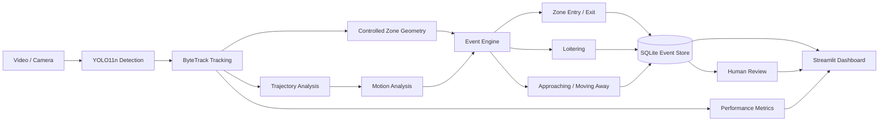

# Real-Time Edge Video Analytics & Event Detection

A GPU-accelerated, edge-oriented computer vision pipeline for real-time object detection, persistent multi-object tracking, controlled-zone monitoring, observable event detection, event persistence, and human-in-the-loop review.

The system focuses on **observable behavior rather than identity or threat classification**.

---

## Features

- YOLO11n object detection
- ByteTrack persistent multi-object tracking
- People and vehicle detection
- Track trajectory visualization
- Resolution-independent controlled zone
- Bottom-center zone membership estimation
- Debounced zone entry and exit detection
- Loitering detection based on video time
- Image-space approaching / moving-away estimation
- SQLite event persistence
- Human-in-the-loop review workflow
- Streamlit monitoring dashboard
- Event filtering and CSV export
- Event timeline and review analytics
- Processed video preview
- FPS and latency benchmarking

---

## Architecture



---

## Processing Pipeline

```text
VIDEO / CAMERA
      ↓
FRAME
      ↓
OBJECT DETECTION
      ↓
MULTI-OBJECT TRACKING
      ↓
TRAJECTORY + ZONE GEOMETRY
      ↓
TEMPORAL / MOTION EVENT ENGINE
      ↓
SQLITE EVENT STORAGE
      ↓
HUMAN-IN-THE-LOOP REVIEW
      ↓
STREAMLIT DASHBOARD
```

---

## Event Types

### ZONE_ENTRY

Generated when a tracked object transitions from outside to inside the controlled zone.

A short temporal debounce is applied before confirming the transition to reduce boundary jitter.

### ZONE_EXIT

Generated when a tracked object transitions from inside to outside the controlled zone.

### LOITERING

Generated when a confirmed track remains inside the zone longer than the configured duration threshold.

Video timeline time is used instead of processing wall-clock time.

### Motion Direction

Recent image-space distance between the tracked object's bottom-center point and the controlled-zone center is used to estimate:

- `APPROACHING`
- `MOVING_AWAY`
- `STABLE`

This represents an image-space trend rather than physical distance in meters.

---

## Human-in-the-Loop Review

New observable events are stored with:

```text
review
```

status.

A human operator can update the event to:

```text
normal
confirmed
```

The review timestamp is persisted in SQLite.

The analytics pipeline does not automatically label people as dangerous, suspicious, civilian, hostile, or threatening.

---

## Dashboard

The Streamlit dashboard provides:

- total event count
- pending review count
- confirmed event count
- normal event count
- event-type filtering
- review-status filtering
- object-class filtering
- editable review status
- event-type analytics
- human-review analytics
- event timeline
- CSV export
- processed video preview

Run the dashboard with:

```powershell
streamlit run src\dashboard.py
```

---

## Project Structure

```text
edge-situational-awareness/
│
├── data/
│   ├── input/
│   └── output/
│
├── src/
│   ├── config.py
│   ├── dashboard.py
│   ├── detect_image.py
│   ├── events.py
│   ├── metrics.py
│   ├── review_event.py
│   ├── storage.py
│   ├── track_video.py
│   ├── video_io.py
│   ├── visualization.py
│   └── zone.py
│
├── .gitignore
├── README.md
└── requirements.txt
```

---

## Tech Stack

- Python
- Ultralytics YOLO11
- PyTorch
- CUDA
- OpenCV
- ByteTrack
- NumPy
- SQLite
- Pandas
- Streamlit
- Plotly
- FFmpeg

Development GPU:

```text
NVIDIA GeForce RTX 3050 Ti Laptop GPU
```

---

## Running the Project

### 1. Create and activate a virtual environment

```powershell
python -m venv .venv
.\.venv\Scripts\Activate.ps1
```

### 2. Install dependencies

```powershell
python -m pip install -r requirements.txt
```

For GPU acceleration, install the appropriate CUDA-enabled PyTorch build for the local system.

### 3. Add an input video

Place the test video at:

```text
data/input/test_video.mp4
```

### 4. Run the analytics pipeline

```powershell
python src\track_video.py
```

The pipeline generates:

```text
data/output/tracked_video.mp4
data/output/events.db
```

### 5. Start the dashboard

```powershell
streamlit run src\dashboard.py
```

---

## Event Persistence

Events are stored in SQLite with fields including:

- event ID
- creation timestamp
- video timestamp
- frame number
- track ID
- object class
- detection confidence
- event type
- zone name
- loitering duration
- human review status
- review timestamp

Example:

```text
Event ID:      5
Video time:    3.00 s
Track ID:      6
Class:         person
Confidence:    81.2%
Event:         LOITERING
Zone:          CONTROLLED_ZONE
Duration:      3.0 s
Review status: normal
```

---

## Performance Benchmarking

The pipeline records:

- YOLO inference latency
- complete tracking-call latency
- end-to-end frame latency
- rolling FPS
- overall pipeline FPS

An example run using a 1280×720, 24 FPS test video on an RTX 3050 Ti Laptop GPU produced approximately:

```text
Overall pipeline FPS          : 17.60
Average inference latency     : 13.49 ms
Average track-call latency    : 20.86 ms
Average end-to-end latency    : 51.48 ms
```

Performance varies with GPU state, power mode, temperature, background processes, and workload.

These values should therefore be treated as a single-run development benchmark rather than a universal performance claim.

---

## Design Decisions

### Bottom-center zone membership

Zone membership is determined using the bottom-center of each tracked bounding box as an approximation of ground contact.

This is generally more suitable for ground-plane zones than using the center of the entire bounding box.

### Temporal debounce

Zone transitions must remain stable for multiple frames before generating an entry or exit event.

This reduces false transitions caused by bounding-box jitter around polygon boundaries.

### Video-time loitering

Loitering duration is calculated using:

```text
frame difference / source FPS
```

instead of processing wall-clock time.

This prevents runtime performance fluctuations from changing the semantic duration of an event.

### Observable-event design

The system identifies observable events such as:

- entering a controlled area
- leaving a controlled area
- remaining inside for a configured duration
- image-space movement relative to a zone

Human operators remain responsible for interpretation and review.

---

## Limitations

- Motion estimation operates in image space rather than calibrated world coordinates.
- No homography or camera calibration is currently applied.
- The controlled zone is currently configuration-based rather than interactively defined.
- Tracking IDs may change under heavy occlusion or difficult scenes.
- Detection confidence represents the model prediction for the object on the event frame, not confidence in the event itself.
- Current development testing primarily uses recorded video.
- Benchmark performance can vary substantially between runs.
- The project does not perform face recognition or identity inference.

---

## Ethics and Safety

The project is intentionally designed around **observable event detection and human review**.

It does not attempt to determine whether a person is:

- hostile
- dangerous
- suspicious
- civilian
- criminal
- an enemy

No automated targeting or autonomous enforcement decision is performed.

The system reports measurable visual events and leaves contextual interpretation to a human operator.

---

## Roadmap

Potential future improvements include:

- FastAPI service layer
- REST endpoints for events, metrics, zones, and review actions
- ONNX Runtime benchmarking
- Docker packaging
- configurable multiple zones
- live webcam and network-stream support
- tracker tuning
- ByteTrack / BoT-SORT comparison
- repeated benchmark runs with mean and standard deviation
- perspective calibration / homography
- deployment testing on dedicated edge hardware

---

## Status

Active portfolio project.

Current milestone includes:

```text
Detection
Tracking
Trajectory analysis
Controlled-zone monitoring
Entry / exit events
Loitering
Motion direction
SQLite persistence
Human review
Interactive dashboard
Performance benchmarking
```